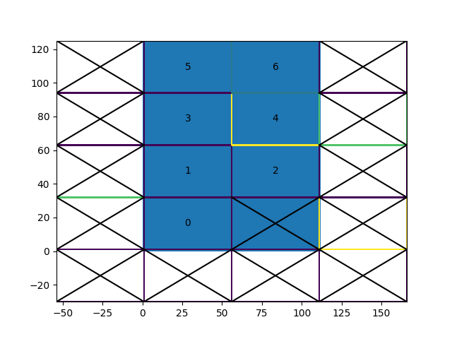

# GETM

This repository contains a rewrite of the General Estuarine Transport Model (GETM) to modern Fortran.

When the first stable version is released (quite some time away) this will be the official version of GETM.

## Installing

### Linux and Mac

You will need the [Anaconda Python distribution](https://www.anaconda.com/products/individual). On many systems that is already installed: try running `conda --version`.
If that fails, you may need to load an anaconda module first: try `module load anaconda` or `module load anaconda3`. If that still does not give you a working `conda` command,
you may want to install [Miniconda](https://docs.conda.io/en/latest/miniconda.html).

Now make sure your conda environment is initialized:

```
conda init bash
```

If you are using a different shell than bash, replace `bash` with the name of your shell (see `conda init -h` for supported ones), or use
`conda init --all`.

This needs to be done just once, as it modifies your `.bashrc` that is sourced every time you login.
After this, restart your shell by logging out and back in.

Now obtain the repository with setups and scripts:

```
git clone --recursive https://github.com/BoldingBruggeman/getm-rewrite.git
cd getm-rewrite
conda env create -f environment.yml
conda activate pygetm
source ./install
```

If you are using a different shell than bash, you may need to replace `source` in the last line  by `bash`. If you are installing on an HPC system that already has a Fortran compiler and MPI libraries that you would like to use, replace `environment.yml` with `environment-min.yml` in the above.

### Windows

As on other platforms, you need [Anaconda](https://www.anaconda.com/products/individual) or [Miniconda](https://docs.conda.io/en/latest/miniconda.html). In addition, you need to ensure that software to obtain and build Fortran code is available. Therefore, install:

* [Git for Windows](https://git-scm.com/download/win)
* [Visual Studio Community 2019](https://my.visualstudio.com/Downloads?q=visual%20studio%202019&wt.mc_id=o~msft~vscom~older-downloads)
* [Intel Fortran Compiler](https://www.intel.com/content/www/us/en/developer/articles/tool/oneapi-standalone-components.html#fortran) - avoid version 2021.4.0, which does not currently work with cmake

If you want to run simulations in parallel, you additionally need:

* [Microsoft MPI](https://www.microsoft.com/en-us/download/details.aspx?id=100593) - you need both the runtime library and the Software Development Kit


Now obtain the repository with setups and scripts, set up your conda environment, and build and install pygetm:

```
git clone --recursive https://github.com/BoldingBruggeman/getm-rewrite.git
cd getm-rewrite
conda env create -f environment-min.yml
conda activate pygetm

mkdir build
cd build
cmake ..\python
cmake --build . --config Release
cmake --install .
```

## Using the model

You should always activate the correct Python environemnt before you use the model with `conda activate pygetm`.
This needs to be done any time you start a new shell.

The best place to start with the model is the [`python/examples`](https://github.com/BoldingBruggeman/getm-rewrite/tree/devel/python/examples) directory with Jupyter Notebooks that demonstrate the functionality of the model:

```
cd python/examples
python -m jupyterlab
```

## Generating optimal subdomain division

A tool is included to calculated an optimal subdomain division provided only a valid bathymetry file _topo.nc_ and the number of processes the setup is to be run on. The tool searches for a solution with the smallest subdomain size that still covers the entire calculation domain. Output of the command (a python pickle file) is used directly as an argument when the domain object is created in the Python run-script.

The command to generate the subdomain division is:
```bash
pygetm-subdiv optimize --legacy --pickle subdiv_7.pickle topo.nc 7
```
The calculated layout can be shown - and plotted - via:
```bash
pygetm-subdiv show subdiv_7.pickle --plot
```
Resulting in in a layout as:



The example is for the standard North Sea case provided by legacy GETM.

To use a given subdomain division at runtime the call to creating the domain object should be similar to:

```python
domain = pygetm.legacy.domain_from_topo(os.path.join(getm_setups_dir, 'NorthSea/Topo/NS6nm.v01.nc'), nlev=30, z0_const=0.001, tiling='subdiv.pickle')
```

Note the *tiling*-argument.

## Running the model in parallel
To run the model in parallel on the command line the _mpiexec_ is used like:
```bash
mpixec -np 7 python north_sea.py
```

Note that the -np 7 argument __must__ match the number of subdomains from the _pygetm-subdiv_ command.

## Contributing

How to contribute to the development:

  1. Make a [fork](https://github.com/BoldingBruggeman/getm-rewrite/projects/4) - upper right -  of the repository to you private GitHub account(\*) 
  2. Make a [pull request](https://docs.github.com/en/free-pro-team@latest/github/collaborating-with-issues-and-pull-requests/about-pull-requests)

Note that all communication in relation to development of GETM is done via GitHub - using [tickets](https://github.com/BoldingBruggeman/tickets/issues), [code](https://github.com/BoldingBruggeman/getm-rewrite), [issues](https://github.com/BoldingBruggeman/getm-rewrite/issues), [projects](https://github.com/BoldingBruggeman/getm-rewrite/projects).


(\*) If you use a service other than GitHub for your daily work - please have a look [here](https://stackoverflow.com/questions/37672694/can-i-submit-a-pull-request-from-gitlab-com-to-github)

https://yarchive.net/comp/linux/collective_work_copyright.html
